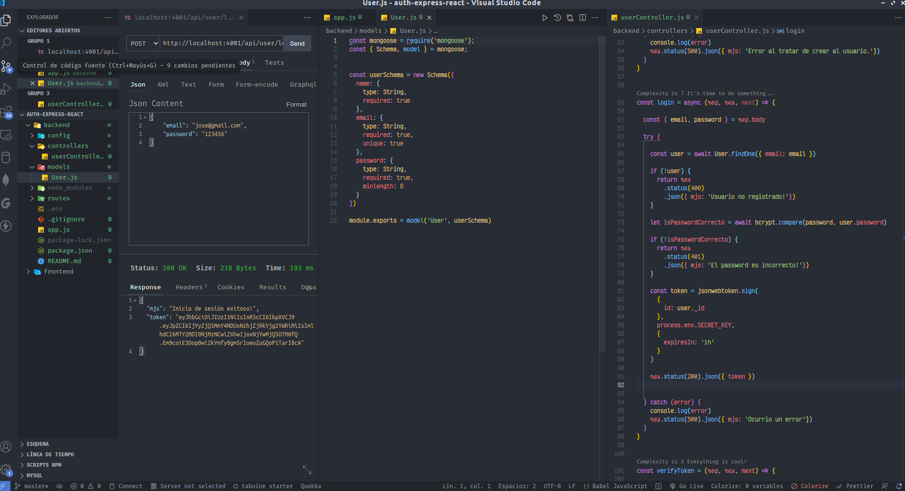

# Mern-Auth App

## Autenticación y autorización basada en JsonWebToken usando el Stack de Mern

Ejemplo de cómo hacer una api con nodejs y express consumiendo datos de una base de datos Mongodb

### Cómo hacer una api con Node.js, express y Mongodb'.'

En este repositorio realizo una api con Node.JS ayudándome de la libreria express para hacer consultas a una base de datos Mongodb'.'